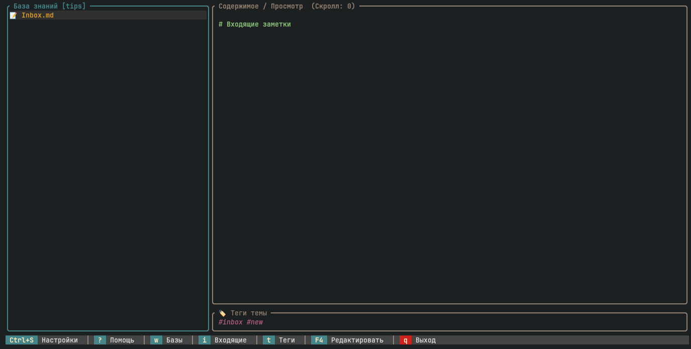
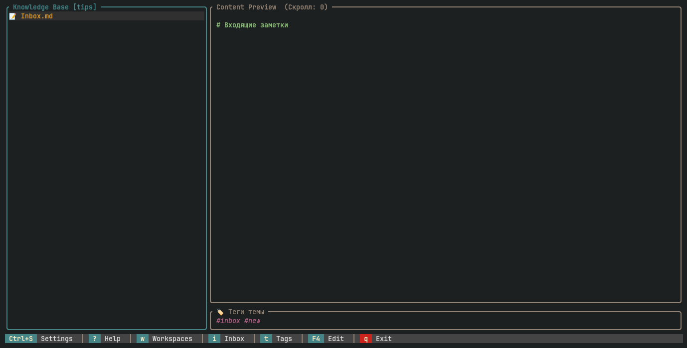
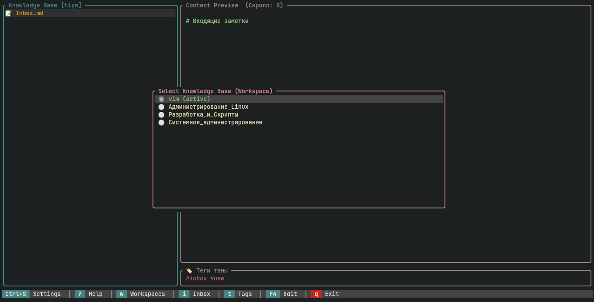
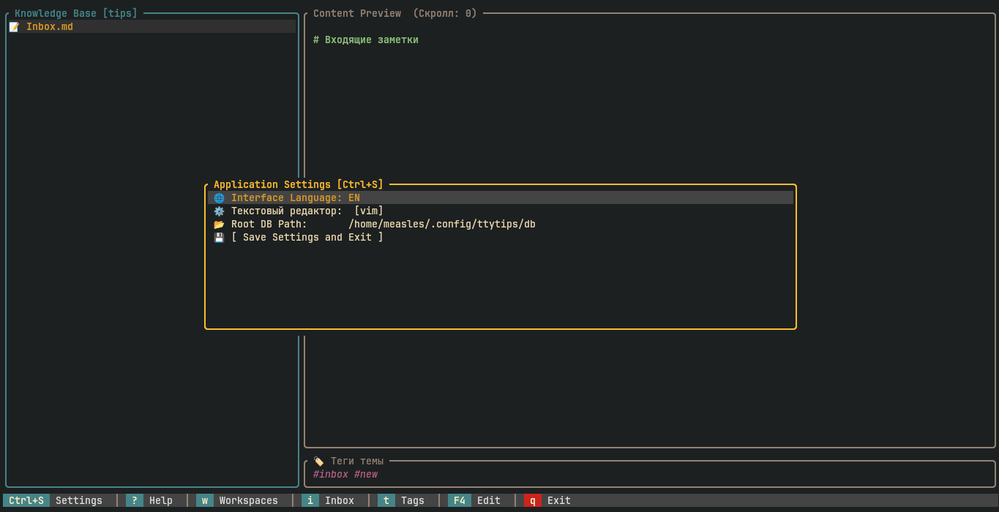

# tips 📝 (v.0.0.1)

## Screenshots
[](screenshots/01.png) [](screenshots/02.png)
[](screenshots/03.png) [](screenshots/04.png)

[English](#english) | [Русский](#русский)

---

## English

A highly modular and lightweight CLI/TUI knowledge base and snippet manager for Linux, designed to store, structure, quickly search, and manage personal tips, cheat sheets, and commands directly inside your text terminal (TTY).

### ✨ Features & Architecture

*   **100% Rust & TUI:** Fast, memory-efficient, and entirely independent of a graphical server (X11/Wayland). Built using `ratatui` and `crossterm`.
*   **Hybrid Data Structure:** Your storage is organized via standard Linux directories (for categories), `.md` files (for themes), and Markdown headers (`#`, `##`) for specific tips. Unlimited tree depth.
*   **Isolated Workspaces (Databases):** Hot-swap between independent knowledge bases with `w` and create new ones interactively using `Shift + N`.
*   **Context-Aware Search:** Search inside your current navigation branch. Supports text search (`/`) and strict hashtag filtering (`t`).
*   **Seamless Vim Integration:** Press `F4` to temporarily suspend the TUI and instantly edit the active note using system `Vim`.
*   **Inbox/Scratchpad Concept:** Fast streaming input to drop random ideas or copied commands on the fly using `i`.
*   **Plain Text Export:** Clean up all Markdown syntax and save any tip as a pure `.txt` file via `F3`.
*   **Modern Visuals:** Modern look featuring golden-ratio panels (30/70), rounded borders, distinct active-state coloring (`Tab` to toggle focus), and a standalone dedicated tag-viewer block.

### ⌨️ Keybindings

*   `Tab` — Toggle focus (Left Folder Tree ↔ Right Content Panel)
*   `↑ / ↓` (or `j / k`) — Navigate lists or vertically scroll through a tip's text
*   `Enter / →` — Open a directory / Dive deeper into file structure
*   `Esc / ←` — Move up a directory level / Return focus to the tree
*   `Ctrl + S` — Interactive app configuration panel (Language, Storage paths)
*   `?` — Open/close the built-in hotkey help menu
*   `+` / `-` — Interactively create or delete directories and files
*   `q` — Gracefully exit the application

### 🚀 Build & Installation

Make sure you have Rust (`cargo`) installed.

```bash
# Clone the repository
git clone https://github.com
cd tips

# Run in development mode
cargo run

# Build optimized release binary
cargo build --release
```
The optimized binary will be available at `./target/release/tips`.

---

## Русский

Высоко модульная и легковесная консольная утилита для ОС Linux, предназначенная для хранения, структурирования, быстрого поиска и управления личной базой знаний (советами, шпаргалками, командами) непосредственно внутри текстового терминала (TTY).

### ✨ Особенности и Архитектура

*   **100% Rust и TUI:** Высокая скорость, эффективная работа с памятью и интерфейс на базе библиотек `ratatui` и `crossterm`. Работает полностью без графического сервера (X11 / Wayland).
*   **Гибридная структура данных:** Папки ОС Linux определяют категории, файлы `.md` — темы, а Markdown-заголовки (`#`, `##`) — конкретные советы. Без ограничений на глубину вложенности дерева.
*   **Изолированные рабочие пространства:** Быстрое переключение между независимыми базами знаний по кнопке `w` и интерактивное создание новых баз через `Shift + N`.
*   **Контекстный поиск:** Поиск заперт строго внутри текущей ветки навигации. Поддерживает текстовый поиск по названиям (`/`) и жесткую фильтрацию по хэштегам (`t`).
*   **Бесшовная интеграция с Vim:** Нажатие `F4` временно сворачивает TUI и мгновенно открывает текущую заметку в системном `Vim` для внесения правок.
*   **Концепция "Входящие" (Inbox):** Быстрый потоковый ввод для сброса мыслей или скопированных команд "на лету" одной строкой по клавише `i`.
*   **Экспорт чистого текста:** Автоматическая очистка Markdown разметки и выгрузка совета в чистый `.txt` по нажатию `F3`.
*   **Современный визуал:** Пропорции золотого сечения (30/70), закругленные рамки окон, мягкая цветовая схема фокусов панелей (`Tab` для перехода) и отдельное выделенное окно для тегов.

### ⌨️ Горячие клавиши

*   `Tab` — Переключить фокус (Левое дерево папок ↔ Правая панель контента)
*   `↑ / ↓` (или `j / k`) — Перемещение по спискам или вертикальный скролл текста
*   `Enter / →` — Открыть папку / Спуститься глубже по иерархии
*   `Esc / ←` — Подняться на уровень выше / Вернуть фокус к дереву тем
*   `Ctrl + S` — Полноценное интерактивное меню настроек программы (Язык, Пути баз)
*   `?` — Вызов встроенного окна справки по всем клавишам
*   `+` / `-` — Интерактивное создание и удаление элементов
*   `q` — Корректный выход из программы

### 🚀 Сборка и Запуск

Убедитесь, что в системе установлен Rust (`cargo`).

```bash
# Клонирование репозитория
git clone https://github.com
cd tips

# Запуск в режиме разработки
cargo run

# Сборка оптимизированного бинарного файла
cargo build --release
```
Финальный бинарный файл появится по пути `./target/release/tips`.
